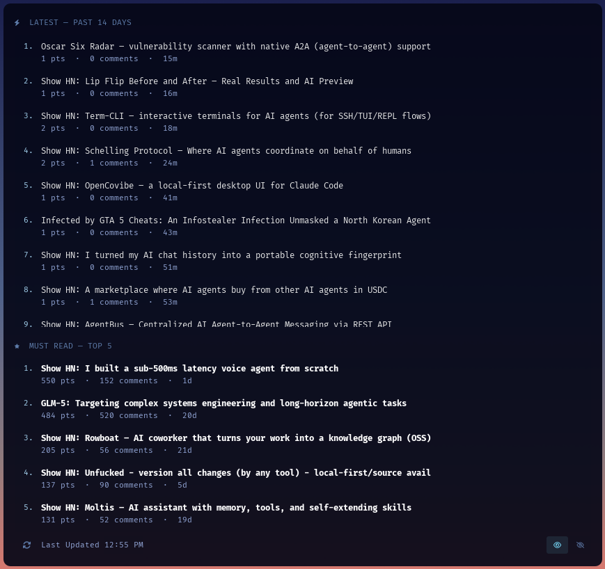

# YCOMBO

> AI & Dev Intelligence Feed: always-on HN desktop widget

YCOMBO is an [eww](https://github.com/elkowar/eww) desktop widget that continuously surfaces the most relevant Hacker News posts on **AI agents, LLM engineering, agentic workflows, and software engineering best practices**, filtered from the noise, displayed directly on your desktop.



---

## Features

- **Latest 40 posts** refreshed every 5 minutes, sorted by recency (last 14 days), keyword-filtered for AI/agent/LLM relevance
- **Must Read Top 5** highest-scored posts (80+ points) from the past 30 days, sorted by votes
- **Scrollable latest posts** the latest section has a styled scrollbar for browsing long lists
- **Fade-on-idle** panel sits at 10% opacity, fades to 100% on hover, fades back after 10 seconds
- **Always-on mode** pin button next to hide keeps the widget fully visible, disabling the fade-out timer
- **Pywal-aware styling** colours pulled from your wallpaper theme (requires pywal)
- **Offline resilience** serves cached results when the network is unavailable, shows "Never" as last updated
- **Zero auth** uses the [Algolia HN API](https://hn.algolia.com/api) (free, no key required)
- **Clickable posts** opens directly on Hacker News in Chromium
- **Keyboard shortcuts** `Super+F5` to refresh, `Super+Shift+F5` to toggle (only with i3 config setup)

---

## Requirements

- Arch Linux (or any distro with `pacman`)
- `eww` (installed via yay if missing)
- `xdotool`
- `python3` + `python-requests`
- FiraCode Nerd Font Mono
- i3 window manager

---

## Install

```bash
git clone git@github.com:z89/ycombo.git ~/Documents/Github-Projects/ycombo
cd ~/Documents/Github-Projects/ycombo
./install.sh
```

The installer will:
1. Install `eww`, `xdotool`, and `python-requests` if missing
2. Set executable permissions on all scripts
3. Fetch initial HN data
4. Add YCOMBO to your i3 config (window rules, autostart, keybindings)
5. Launch the widget

---

## Files

| File | Purpose |
|---|---|
| `ycombo.py` | Fetches and filters HN posts via Algolia API, writes `/tmp/ycombo_cache.json` |
| `eww/eww.yuck` | Widget layout: sections, posts, footer, hover opacity |
| `eww/eww.scss` | Styling: pywal colours, opacity transitions, hover states |
| `ycombo-daemon.sh` | Background loop running `ycombo.py` every 5 minutes |
| `ycombo-start.sh` | Startup script: kills stale processes, launches daemon + widget |
| `ycombo-refresh.sh` | Force refresh with loading spinner |
| `ycombo-toggle.sh` | Toggle widget visibility |
| `install.sh` | One-command setup |

---

## Configuration

### Positioning

Edit the window geometry in `eww/eww.yuck`:

```lisp
(defwindow ycombo
  :geometry (geometry :x "15px" :y "46px" :width "860px" :anchor "top left")
  :stacking "bg"
  ...)
```

### Keywords

Edit the `RELEVANT` list in `ycombo.py` to tune which posts pass the filter. Edit `LATEST_QUERIES` and `TOP5_QUERIES` to change the Algolia search terms.

### Colours

Colours are set in `eww/eww.scss` using the pywal palette from your desktop theme.

---

## How It Works

```
Every 5 minutes:
  ycombo-daemon.sh > ycombo.py
                       |-- fetch_latest()  > 8 Algolia queries, deduplicated,
                       |                      keyword-filtered, sorted by date > top 40
                       +-- fetch_top5()    > 5 Algolia queries, 80+ pts,
                                              last 30d, sorted by score > top 5
                     |
                  Writes /tmp/ycombo_cache.json
                     |
                  eww polls cache every 2s > widget updates
```

---

## Uninstall

```bash
pkill -f ycombo-daemon.sh
eww --config ~/Documents/Github-Projects/ycombo/eww close ycombo
# Remove YCOMBO lines from ~/.config/i3/config
# Delete the ycombo directory
```

---

## License

MIT
